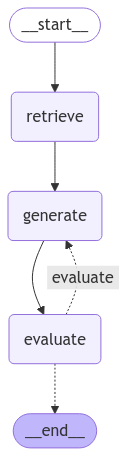

# LoreLit – AI-Powered IELTS Reading Practice
---

## 📖 Introduction  
Learning IELTS reading can be **boring and discouraging**, especially when dealing with **long, unengaging passages**. **LoreLit** solves this problem by allowing users to **learn IELTS reading through topics they enjoy**, making the learning process more engaging and effective.

This project integrates **scraping and AI-powered question generation**, ensuring high-quality, IELTS-style reading tasks tailored to user preferences.

🔹 **Live Demo:** 

https://github.com/user-attachments/assets/00a8352a-d856-470c-8567-1b3597f906ea

---

## 🎯 Purpose  
LoreLit is designed to:  
✅ **Make IELTS reading more engaging** by generating passages on topics users enjoy.  
✅ **Ensure high-quality question generation** using rule-based logic and structured prompts.  
✅ **Automate the process** with a structured workflow, reducing manual effort in question creation.  

---

## 🛠️ Methods Used  

### 📌 1. Data Scraping  
- Retrieves text data from [LoL.](https://universe.leagueoflegends.com/en_US/champions/) 
- Focuses on **structured and relevant** content to maintain readability.  

### 📌 2. AI-Powered Question Generation  
- Implements **rule-based logic and structured prompts** to ensure generated questions align with IELTS standards.  
- Uses **LangGraph** to structure a **workflow with interconnected nodes**: User Input -> Retrieve Data -> Iterative(Generation & Evaluation)
- If a question **does not meet quality standards**, it is **regenerated** before being returned to the user.  

